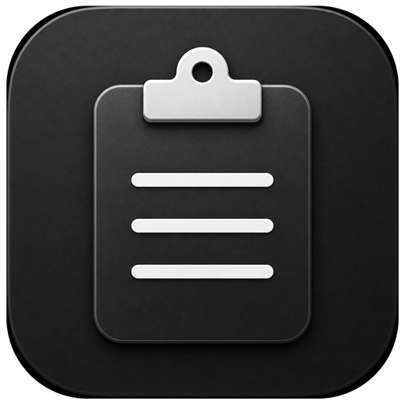

<p align="center">
  
</p>

<h1 align="center">Cliploom</h1>

<p align="center">
  在不同设备上，保持同一套复制、粘贴、截图与识别习惯
</p>

<p align="center">
  
  
  
  
</p>

<p align="center">
  <a href="#下载安装">下载安装</a> ·
  <a href="#使用指南">使用指南</a> ·
  <a href="#跨设备操作逻辑">跨设备操作逻辑</a> ·
  <a href="#开发指南">开发指南</a> ·
  <a href="WINDOWS_PORT.md">Windows 接力</a>
</p>

---

Cliploom 是一个常驻菜单栏的剪贴板与截图工具。macOS 版本已经可以使用，
Windows 版本可依据同一套产品行为继续开发。

这个项目不只是做两个外观相似的应用，而是希望在 Mac 和 Windows 之间切换时，
仍然使用相同的分类方式、键盘导航、确认/取消规则和截图工作流，减少重新适应。

## 下载安装

### 系统要求

- macOS 14 或更高版本
- 支持 Apple Silicon 与 Intel Mac

### 第 1 步：下载安装包

前往
[Cliploom 0.1.1 Developer Preview](https://github.com/ywjzywn-coder/Cliploom/releases/tag/v0.1.1)，
下载：

```text
Cliploom-0.1.1-macOS-universal-unnotarized.dmg
```

成功标志：下载目录中出现 `.dmg` 文件。

### 第 2 步：安装

1. 双击打开 DMG。
2. 将 `Cliploom.app` 拖入 `Applications`。
3. 在“应用程序”中找到 Cliploom。

成功标志：`/Applications/Cliploom.app` 存在。

### 第 3 步：首次打开

当前安装包没有 Apple Developer ID 公证，macOS 会提示无法验证开发者。

1. 在“应用程序”中右键点击 Cliploom。
2. 选择“打开”。
3. 在第二次提示中再次选择“打开”。

如果仍被拦截，前往“系统设置 > 隐私与安全性”，在安全提示旁点击“仍要打开”。

成功标志：菜单栏出现 Cliploom 图标。

> 安装包使用固定的 Bundle ID 和应用身份规则，以尽量让权限在覆盖更新后保持稳定。
> 但未使用 Developer ID 的版本无法保证所有 macOS 版本都不会重新确认权限。

更详细的小白安装步骤见 [安装指南](docs/INSTALL.md)。

## 使用指南

### 剪贴板历史

1. 在任意应用中复制文本、链接、图片或文件。
2. 按 `Option+V` 打开 Cliploom。
3. 使用方向键选择内容。
4. 按回车粘贴，按 `Esc` 关闭。

面板支持全部、文本、链接、图片、文件和收藏分类，也可以搜索、收藏和删除记录。
相同内容再次复制时只会更新时间并置顶。

### 截图

1. 按 `Option+A` 启动截图。
2. 单击识别到的窗口，或者拖动创建自由选区。
3. 使用矩形、箭头、画笔、文字或马赛克进行标注。
4. 按回车或点击完成，将 PNG 写入剪贴板和 Cliploom 图片历史。

选区外单击会取消截图，`Esc` 也可以随时退出。

### OCR

框选后点击 OCR：

- 截图层会隐藏。
- 左侧显示所选图片，右侧显示可编辑文字。
- 中间分隔线可以拖动，比例会被记住。
- 再次按 `Option+A` 会关闭旧结果并开始新截图。

### 二维码和条形码

框选后点击扫码，结果窗口会显示识别到的码制和内容：

- 普通内容可以复制。
- 只有合法的 HTTP/HTTPS 地址会显示“打开链接”。
- Cliploom 不会自动打开识别到的网址。

### 菜单栏

菜单栏入口可以打开剪贴板、启动截图、暂停记录、清空历史、进入设置或退出应用。
快捷键和开机启动可以在设置中修改。

## 权限设置

| 权限 | 用途 | 未授权时 |
| --- | --- | --- |
| 辅助功能 | 恢复原应用并模拟 `Command+V` | 只复制，需要手动粘贴 |
| 屏幕与系统音频录制 | 捕获屏幕和窗口 | 无法启动截图 |

首次使用时按照应用引导打开“系统设置 > 隐私与安全性”，允许 Cliploom 后重新打开应用。

覆盖安装新版本时，请始终保持应用名称为 `Cliploom.app`，并安装在 `/Applications`。
不要同时保留多个副本，否则 macOS 可能把它们当作不同应用并重新询问权限。

## 跨设备操作逻辑

Windows 版本不需要复制 macOS 的视觉细节，但必须保持这些操作规则：

| 操作 | macOS | Windows 目标 |
| --- | --- | --- |
| 打开剪贴板 | `Option+V` | `Alt+V` |
| 启动截图 | `Option+A` | `Alt+A` |
| 移动选择 | 方向键 | 方向键 |
| 确认/粘贴 | `Enter` | `Enter` |
| 取消/关闭 | `Esc` | `Esc` |
| 内容分类 | 文本、链接、图片、文件、收藏 | 相同 |
| 截图流程 | 选区、标注、OCR、扫码、完成 | 相同 |
| 数据策略 | 本地存储、主动清理 | 相同 |

平台差异由底层服务处理，用户不应该重新学习产品。

Windows 开发者或 Agent 请从 [WINDOWS_PORT.md](WINDOWS_PORT.md) 开始。
文档包含 Windows API 映射、模块接口、开发阶段、测试矩阵和完成标准。

## 数据与隐私

- 剪贴板历史、截图、OCR 和扫码均在本机处理。
- 项目不包含云同步、遥测或自动上传。
- 图片缓存位于 `~/Library/Application Support/PasteBox/Images`。
- 文件记录只保存路径，不复制、移动或删除原文件。
- 未收藏记录最多保留 500 条或 30 天，收藏记录不自动清理。

这里的“跨设备同步”指同步产品操作逻辑，不代表自动同步用户剪贴板数据。

## 开发指南

### macOS

技术栈：

- Swift 5
- SwiftUI 与 AppKit
- SwiftData
- ScreenCaptureKit
- Vision

使用 Xcode 打开 `PasteBox.xcodeproj`，选择 `PasteBox` Scheme 和 `My Mac`，
按 `Command+R` 运行。

运行单元测试：

```bash
xcodebuild \
  -project PasteBox.xcodeproj \
  -scheme PasteBox \
  -destination 'platform=macOS' \
  -derivedDataPath /tmp/PasteBoxDerivedData \
  -only-testing:PasteBoxTests \
  test
```

成功标志：终端显示 `** TEST SUCCEEDED **`。

### Windows

推荐使用 C#、.NET 8、WinUI 3、SQLite 和 Windows Graphics Capture。
不要逐行翻译 Swift；应复用 [Windows 接力文档](WINDOWS_PORT.md) 中定义的行为合同。

建议从独立分支开始：

```bash
git switch -c windows/main
```

成功标志：`git branch --show-current` 显示 `windows/main`。

## 构建安装包

生成当前这种未公证 Universal DMG：

```bash
./Scripts/package-preview.sh
```

成功标志：`build/preview` 中出现 DMG 和 `SHA256SUMS.txt`。

生成正式分发包需要 Developer ID Application 证书和 Apple 公证：

```bash
DEVELOPER_ID_APPLICATION='Developer ID Application: Your Name (TEAMID)' \
NOTARY_KEYCHAIN_PROFILE='cliploom-notary' \
CLIPLOOM_BUNDLE_ID='你的固定反向域名.BundleID' \
./Scripts/release-macos.sh
```

版本变化见 [CHANGELOG.md](CHANGELOG.md)。

## 项目结构

```text
PasteBox/
├── App/          应用生命周期与菜单栏协调
├── Models/       SwiftData 剪贴板模型
├── Services/     监听、存储、热键、权限与粘贴
├── Screenshot/   捕获、选区、标注、OCR 与扫码
└── UI/           剪贴板面板、设置与原生视觉组件
PasteBoxTests/    核心行为测试
Scripts/          本地安装、预览打包和正式发布
docs/             安装与版本发布说明
```
